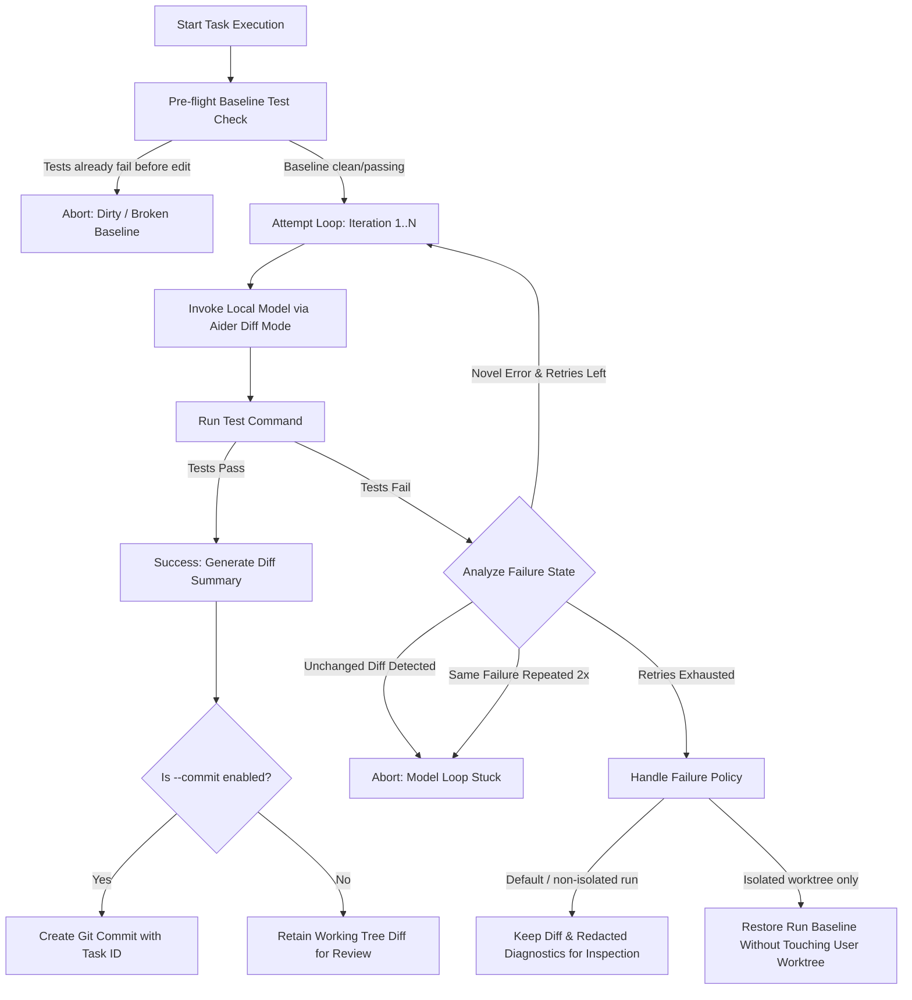

# Hybrid Spec-Driven SDLC Toolkit (Architecture & Implementation Plan)

## Executive Summary

The **Hybrid Spec-Driven SDLC Toolkit** (`hybrid-sdlc`) bridges high-reasoning cloud agents (such as Antigravity, Claude Code, and Codex) with cost-effective local inference (Qwen 2.5 Coder 32B running on an RTX 3090 via `llama-server`). 

**Key Clarification on Token Economics**:
Cloud agents perform initial architecture, decomposition, and contract specification. During the 2–10 minute local editing and testing cycle, **no cloud-model tokens are consumed**. Once local execution concludes, deterministic test and policy checks run first; cloud agents may then resume to review structured diffs and advance task state. Agent review is judgment-based rather than deterministic and may consume cloud-model tokens.

This plan addresses all architecture and security review findings: formalizing the execution lifecycle, establishing strict security boundaries, correcting Spec Kit directory conventions, defining bounded editing loops, and providing a canonical CLI and multi-host distribution model.

---

## 1. Architectural Decisions & Resolution of Review Findings

### 1.1 Job Lifecycle & Execution Model ([P0])

Standard MCP does not define agent turn suspension or background resume. To ensure universality across hosts, the toolkit implements two distinct execution semantics:

```
+---------------------------------------------------------------------------------------+
|                                     Execution Models                                  |
+-------------------------------------------+-------------------------------------------+
| Mode A: Synchronous Tool Call             | Mode B: Asynchronous Job Lifecycle        |
| (`run_spec_task_sync`)                    | (`submit_spec_job`, `get_job_status`)     |
+-------------------------------------------+-------------------------------------------+
| - Host blocks/waits on tool execution.    | - Non-blocking: returns `job_id` and logs |
| - Streams progress via MCP notifications. | - State persisted in `.hybrid_sdlc/jobs/` |
| - Subject to host tool-call timeouts.     | - Agent yields turn or polls.             |
| - Best for short tasks or blocking hosts. | - Enables native reactive wakeup on AGY.  |
+-------------------------------------------+-------------------------------------------+
```

#### Host Support Matrix

| Host Environment | Recommended Mode | Wakeup / Resume Mechanism |
| :--- | :--- | :--- |
| **Antigravity IDE** | Asynchronous Job | Native reactive wakeup: triggers background process, yields turn, wakes on process exit via IDE task messaging. |
| **Claude Code** | Synchronous Tool | Blocking tool execution with MCP progress notifications; or background terminal command with notification. |
| **Codex CLI / Cursor** | Synchronous or Polling | Synchronous tool execution, or asynchronous job with explicit polling fallback (`hybrid-sdlc status <job_id>`). |
| **Headless CI / CLI** | Synchronous | Direct CLI exit code (`hybrid-sdlc run-task ...`). |

#### Job State Persistence & Schema
Job states are persisted to `.hybrid_sdlc/jobs/<job_id>.json`:
- `job_id`: Format `job_<timestamp>_<uuid8>`.
- `spec_path` & `task_id`: Spec Kit task references.
- `status`: `queued` | `running` | `completed` | `failed` | `cancelled`.
- `failure_reason`: Optional machine-readable reason such as `abandoned_process`, `timeout`, `test_failure`, or `security_policy`.
- `worker_pid`, `child_pid`, and process creation timestamps for health, PID-reuse detection, and cancellation tracking.
- `created_at`, `updated_at`, `duration_seconds`.
- `attempts`: Array of attempt records (iteration index, test exit code, test stdout/stderr summary, diff stats).
- `final_diff_patch`: Path to diff file in `.hybrid_sdlc/runs/<job_id>.patch`.
- `log_file`: Path to raw stdout/stderr execution log.

#### Cancellation & Recovery
- **Cancellation**: `cancel_spec_job(job_id)` terminates the full process tree using OS-specific process-group signaling (`os.killpg` on POSIX, Win32 Job Object or `taskkill /T /F` on Windows).
- **Recovery**: On startup and status queries, the job manager inspects running jobs. If the recorded PID is dead or its creation time does not match, the job transitions to `failed` with `failure_reason: abandoned_process`.
- **Atomicity**: State updates are written to a temporary file, flushed, and atomically replaced under a per-job lock so readers never observe partial JSON.

#### Asynchronous Process Ownership
- The stdio MCP process is a client-facing adapter, not the owner of long-running jobs.
- `submit_spec_job` launches a separate `hybrid-sdlc worker <job_id>` process. The worker owns the Aider/test process group or Windows Job Object and continues if the MCP connection closes.
- The worker persists heartbeats and terminal state. Status commands never infer success solely from PID existence.
- A future daemon may replace per-job workers, but Phase 3 will implement only one ownership model to avoid split semantics.

---

### 1.2 Trust Model, Policy Guard & Process Handling ([P0])

Because the runner edits files and executes repository-defined test commands, explicit trust boundaries are mandatory.

#### Threat Model
- **Trusted in the initial release**: The repository, its build/test scripts, the local model endpoint, and the user-selected command profiles.
- **Untrusted**: Agent/MCP arguments, paths supplied by prompts, model-generated edits, and unexpected subprocess output.
- The initial policy guard prevents accidental path escape, shell injection, unintended environment inheritance, and worktree corruption. It is **not an OS security sandbox**: approved test/build processes still run with the current user's filesystem and network permissions.
- Running untrusted repositories requires a separately configured sandbox provider (container, restricted OS account, or host sandbox). The CLI must reject `--untrusted` when no sandbox provider is available rather than imply confinement it cannot enforce.

```
[Agent Request] ---> [Policy Guard] ---> [Sanitized Subprocess Execution]
                          |
                          +--> 1. Path Confinement (Repo Root & Symlink Resolution)
                          +--> 2. Argv / Allowlist Command Validation
                          +--> 3. Environment & Secret Scrubbing
                          +--> 4. Worktree Locking & Dirty State Check
                          +--> 5. Process Tree Cleanup & Resource Quotas
```

1. **Repository-Root Selection & Path Validation**:
   - Every CLI/MCP execution request carries an explicit `repo_root`. For interactive CLI use only, it may default to `git rev-parse --show-toplevel`; `Path.cwd()` alone is never treated as proof of repository identity.
   - Every file path (spec file, target source files) must resolve strictly within the verified repository root.
   - Symlinks are resolved (`Path.resolve()`); any link targeting paths outside `repo_root` raises `SecurityBoundaryError`.
2. **Named Command Profiles**:
   - Test commands are named profiles in `hybrid_sdlc.toml`, each containing an argv array, working directory, timeout, and optional environment allowlist. MCP and CLI callers select a profile name; they do not submit shell strings.
   - Raw `shell=True` execution and ad-hoc shell parsing are prohibited. Shell operators are ordinary arguments and never interpreted by a shell.
   - Executables are resolved to trusted absolute paths at configuration-validation time. Profiles using Python or package managers are explicitly documented as arbitrary-code execution within the trusted repository, not as a sandbox boundary.
3. **Secret & Environment Scrubbing**:
   - Subprocesses run in an isolated environment.
   - Any environment variable matching `*API_KEY*`, `*SECRET*`, `*TOKEN*`, `AWS_*`, `GITHUB_*`, `ANTHROPIC_*`, or `GEMINI_*` is stripped.
   - Local dummy credentials (`OPENAI_API_KEY="local-no-key"`) are injected for local OpenAI-compatible endpoints.
4. **Resource Quotas & Process Cleanup**:
   - Per-attempt timeout: 180 seconds. Per-task wall-clock timeout: 600 seconds (configurable).
   - Log buffer cap: Max 500 KB of stdout/stderr captured per run to prevent memory ballooning.
   - Process tree cleanup: All child processes spawned by Aider or the test runner are placed in a process group or Windows Job Object, ensuring zero orphaned processes on exit or cancellation.
5. **Worktree Locking & Concurrency Policy**:
   - Initial-release pre-flight: Run `git status --porcelain` and abort on any tracked or untracked change. Dirty-tree execution is not supported until isolated worktrees land in Phase 5.
   - File lock: Acquire an advisory lock (`.hybrid_sdlc/runner.lock`) via `filelock` to prevent concurrent local runs from corrupting the worktree.
6. **Explicit Commit Opt-In**:
   - Automatic git commits are **disabled by default**.
   - Git commits require explicit `--commit` flag. By default, changes remain in the working tree for agent/human diff review.
7. **Artifact Privacy**:
   - `.hybrid_sdlc/` is excluded from Git. Job files and logs use user-only permissions where supported.
   - Logs, prompt excerpts, and patches pass through configurable redaction before persistence; raw full prompts are disabled by default.
   - Default retention is 7 days with explicit `hybrid-sdlc clean --older-than <duration>` cleanup.

---

### 1.3 Spec Kit Directory Layout ([P1])

In conformance with the current [GitHub Spec Kit specification](https://github.com/github/spec-kit), all artifacts strictly follow the official layout:

```
.specify/
├── memory/
│   └── constitution.md        # Core coding rules, testing policy, architectural constraints
└── templates/
    ├── spec-template.md       # User stories, functional & non-functional requirements
    ├── plan-template.md       # Technical contracts, architecture, types, and dependencies
    └── tasks-template.md      # Atomic, reviewable, single-focus implementation tasks

specs/
└── <NNN-feature-name>/        # e.g., specs/001-local-delegate/
    ├── spec.md                # Feature specification
    ├── plan.md                # Implementation contracts & architectural plan
    └── tasks.md               # Ordered checklist of atomic tasks
```

---

### 1.4 Canonical CLI Contract & Entry Points ([P1])

A unified CLI interface is exposed through standard entry points:

- **Console Script**: `hybrid-sdlc <subcommand> [options]`
- **Python Module**: `python -m hybrid_sdlc <subcommand> [options]`

#### Commands & Arguments

```bash
# 1. Health & Environment Check
hybrid-sdlc check [--host-url URL] [--probe-all]

# 2. Synchronous Task Execution
hybrid-sdlc run-task <spec_file> --repo-root <path> --task-id <id> --test-profile <name> [--commit] [--max-retries 3]

# 3. Asynchronous Job Operations
hybrid-sdlc submit <spec_file> --repo-root <path> --task-id <id> --test-profile <name>
hybrid-sdlc status [job_id] [--wait] [--poll-interval 10]
hybrid-sdlc cancel <job_id>
hybrid-sdlc clean --older-than <duration>

# 4. Spec Kit Initialization
hybrid-sdlc init [--target-dir .] [--force]

# 5. Model Context Protocol Server (Stdio)
hybrid-sdlc mcp
```

---

### 1.5 Bounded Editing and Testing Loop ([P1])

The local execution engine wraps Aider in an autonomous, bounded loop designed to fail fast on non-productive states:



1. **Loop Caps**: Max 3 iterations (default), task timeout 600s.
2. **Stuck Loop Detection**:
   - Computes SHA-256 of the git diff after each iteration. If an iteration produces an identical diff or zero changes while tests still fail, abort immediately.
   - Computes test failure signature (failing test names + exception lines). If the exact same signature repeats across 2 consecutive iterations, abort.
3. **Traceability**: Redacted attempt summaries, diff hashes, test signatures, and artifact paths are recorded in `.hybrid_sdlc/runs/<run_id>.json`. Raw prompts are not persisted by default.
4. **Rollback Rule**: Destructive whole-tree commands such as `git checkout .`, `git reset --hard`, and `git clean` are prohibited. Rollback is available only inside an isolated worktree and restores the recorded run baseline.

---

### 1.6 Dynamic Endpoint Probing & Local Inference Configuration ([P2])

Static endpoint configuration in `.aider.conf.yml` cannot dynamically fall back between ports. Instead, `server_probe.py` evaluates candidate servers dynamically and injects verified parameters directly into Aider.

#### Probing Workflow
1. Probe candidate endpoints: `http://127.0.0.1:8090/v1` (primary) and `http://127.0.0.1:8089/v1` (secondary).
2. Fetch `/v1/models` and verify model availability.
3. Perform a lightweight test inference (`max_tokens=5`) to verify GPU responsiveness.
4. Return an active `ServerEndpoint` configuration.

#### Target Hardware & Model Profiles
- **Candidate Primary Configuration (RTX 3090 24GB VRAM; support pending Phase 7 benchmarks)**:
  - Model: `Qwen/Qwen2.5-Coder-32B-Instruct-GGUF` (Quant: `Q4_K_M`, ~19.8 GB VRAM).
  - Context Window: 16,384 tokens (`-c 16384`).
  - Backend: `llama-server` with Flash Attention enabled (`-fa`) and split-mode support.
- **Fall-back Profile (Low VRAM / Laptop GPU)**:
  - Model: `Qwen/Qwen2.5-Coder-14B-Instruct-GGUF` (Quant: `Q8_0` or `Q4_K_M`).

#### Aider Invocation Parameters
Parameters are passed explicitly via CLI:
```bash
aider --model openai/<model_id> \
      --openai-api-base <active_endpoint_url> \
      --openai-api-key local-no-key \
      --edit-format diff \
      --no-auto-commits \
      --no-suggest-shell-commands \
      --yes-always
```

---

### 1.7 Host Plugin Distribution Model ([P1])

Rather than assuming all tools share a single installation marketplace, each host is targeted with its native mechanism:

1. **Antigravity IDE**:
   - Discoverable via workspace customizations (`.agents/skills/local-delegate/SKILL.md`) or global config plugin (`~/.gemini/config/plugins/hybrid-sdlc/plugin.json`).
   - Registers MCP server via `mcp_config.json`.
2. **Claude Code**:
   - Configured via `.claude/mcp.json` or user `~/.claude.json` referencing `hybrid-sdlc mcp`.
   - Workflow documented in repository `CLAUDE.md`.
3. **Codex CLI**:
   - Manual MCP registration uses `codex mcp add hybrid-sdlc -- hybrid-sdlc mcp`, persisted by Codex in the user configuration (`~/.codex/config.toml`). The project does not claim `.codex/mcp.json` support.
   - Plugin distribution uses `.codex-plugin/plugin.json`, a root `skills/local-delegate/SKILL.md`, and a tested local marketplace entry. Manual MCP registration and plugin installation are documented as separate paths.

---

## 2. Proposed Project Structure

Target Repository: `c:\Users\ray\Documents\workspace\hybrid_sdlc`

```
hybrid_sdlc/
├── .specify/
│   ├── memory/
│   │   └── constitution.md              # Project constitution (TDD, safety, contracts)
│   └── templates/
│       ├── spec-template.md             # Standard feature specification
│       ├── plan-template.md             # Technical design & contract template
│       └── tasks-template.md            # Atomic task breakdown template
├── specs/                               # Active & completed feature specs
├── src/
│   └── hybrid_sdlc/
│       ├── __init__.py                  # Package exports & version
│       ├── __main__.py                  # Enables `python -m hybrid_sdlc`
│       ├── cli.py                       # Canonical CLI (click/argparse)
│       ├── config.py                    # Settings, timeouts, allowlists, defaults
│       ├── security.py                  # Trust policy, path validation, environment scrub
│       ├── command_profiles.py          # Named argv profiles and executable resolution
│       ├── artifacts.py                 # Atomic persistence, redaction, retention
│       ├── server_probe.py              # Dynamic llama-server probing & health check
│       ├── job_manager.py               # Job lifecycle, state persistence, cancellation
│       ├── worker.py                    # Detached asynchronous job owner
│       ├── aider_runner.py              # Bounded Aider subprocess execution & diff tracking
│       ├── git_tools.py                 # Git status, worktree lock, diff stats
│       ├── spec_initializer.py          # Spec Kit scaffolding & template generator
│       └── mcp_server.py                # Stdio MCP Server (Sync & Async tools)
├── skills/
│   └── local-delegate/
│       └── SKILL.md                     # Agent skill instructions for delegation
├── tests/
│   ├── unit/
│   │   ├── test_security.py             # Confinement, secret scrub, command allowlist
│   │   ├── test_server_probe.py         # Dynamic fallback, model health checks
│   │   └── test_job_manager.py          # Job persistence, status transitions
│   └── integration/
│       ├── test_bounded_loop.py         # Retry limits, unchanged diff abort, timeouts
│       └── test_cli.py                  # CLI command contract tests
├── pyproject.toml                       # Build system, dependencies, console scripts
├── README.md                            # Comprehensive documentation & setup guide
└── .gitignore                           # Git ignore rules
```

---

## 3. Implementation Delivery Sequence (Phased Roadmap)

```mermaid
gantt
    title Delivery Roadmap
    dateFormat  X
    axisFormat  Day %d
    section Phase 1: Core Engine
    Single-repo runner, policy guard, bounded loop, JSON results    :active, p1, 0, 4
    section Phase 2: Fixture E2E
    End-to-end task against fixture repo, failure/cancel tests      :p2, after p1, 3
    section Phase 3: MCP & Lifecycle
    MCP adapter, sync & async job lifecycle, state persistence       :p3, after p2, 2
    section Phase 4: Spec Kit Integration
    Correct layout (.specify/memory, specs/), idempotent init       :p4, after p3, 2
    section Phase 5: Worktree & Commits
    Opt-in commits, worktree isolation, locking                      :p5, after p4, 2
    section Phase 6: Host Adapters
    Antigravity & Codex packaging, skills, bootstrap guides         :p6, after p5, 2
    section Phase 7: Verification & Benchmarks
    Multi-OS CI matrix, RTX 3090 model benchmarks                   :p7, after p6, 2
```



### Phase 1: Core Runner & Security Boundary (Foundational)
**Status: Complete — 2026-09-09.** The frozen install and CLI smoke test pass. The full
quality gate passes with 97 tests and 81.47% branch coverage; detailed evidence and task
closure are recorded in `docs/implementation_tasks.md`.

- Implement `security.py` (path confinement, command allowlist, secret scrubbing).
- Implement `config.py`, named command profiles, explicit repository-root validation, and executable resolution.
- Implement `artifacts.py` with atomic writes, redaction, restrictive permissions, and retention metadata.
- Implement `server_probe.py` with dynamic fallback between ports 8090 and 8089.
- Implement `aider_runner.py` with bounded retries, diff tracking, and structured JSON results.
- Implement the canonical CLI entry points and stable exit-code/result schemas.
- No automatic commits, dirty-tree execution, or destructive rollback; verify in-place diffs only.

### Phase 2: Fixture Validation & Error Handling
- Create test fixture repository with intentional failures.
- Validate loop exit on: test pass, unchanged diff, repeated error signature, and timeout.
- Validate process tree termination during simulated task cancellation.

### Phase 3: MCP Server & Formal Job Lifecycle
- Implement `job_manager.py` with persisted state in `.hybrid_sdlc/jobs/<job_id>.json`.
- Implement `worker.py` as the sole owner of asynchronous child process groups and terminal state.
- Implement `mcp_server.py` exposing:
  - `check_local_model()`
  - `run_spec_task_sync(repo_root, spec_path, task_id, test_profile)`
  - `submit_spec_job(repo_root, spec_path, task_id, test_profile)`
  - `get_job_status(job_id)`
  - `cancel_spec_job(job_id)`

### Phase 4: Spec Kit Layout & Idempotent Init
- Implement `spec_initializer.py` applying `.specify/memory/constitution.md` and `.specify/templates/`.
- Ensure `hybrid-sdlc init` is idempotent and will not overwrite existing customized files without `--force`.

### Phase 5: Worktree Isolation & Opt-in Commits
- Implement advisory worktree locking (`.hybrid_sdlc/runner.lock`).
- Run delegated edits in an isolated Git worktree and record its baseline commit.
- Add `--commit` flag with structured commit message linking to task ID.
- Provide rollback only inside the isolated worktree; never reset or clean the user's working tree.

### Phase 6: Host Integration & Skills
- Author unified `skills/local-delegate/SKILL.md`.
- Generate configuration manifests for Antigravity, Claude Code, and Codex CLI.
- Provide step-by-step installation instructions for each host.

### Phase 7: Multi-OS CI & Hardware Benchmarks
- Set up GitHub Actions matrix covering Windows, Ubuntu, and macOS.
- Benchmark Qwen 2.5 Coder 32B (Q4_K_M) on RTX 3090: tokens/second, VRAM footprint under 16k context, and prompt processing times.

---

## 4. Comprehensive Verification Plan

### 4.1 Automated Test Suite

#### Security & Confinement Tests (`tests/unit/test_security.py`)
- Reject path traversal attempts: `../../etc/passwd`, `C:\Windows\System32`.
- Reject symlinks resolving outside workspace root.
- Reject missing, non-Git, or mismatched explicit repository roots.
- Verify environment scrubbing removes `OPENAI_API_KEY`, `ANTHROPIC_API_KEY`, `AWS_SECRET_ACCESS_KEY`.
- Reject unknown command profiles and profiles whose executable does not resolve to an approved absolute path.
- Verify command arguments are passed unchanged without shell interpretation on Windows and POSIX.
- Verify artifact redaction, user-only permissions where supported, and retention cleanup.

#### Engine & Bounded Loop Tests (`tests/integration/test_bounded_loop.py`)
- Verify task terminates within `max_retries` when tests consistently fail.
- Verify unchanged diff detection halts execution on iteration 2 rather than looping.
- Verify repeated test failure signature detection halts execution.
- Verify wall-clock timeout kills subprocess tree cleanly.
- Verify every dirty worktree is rejected before Phase 5 isolation.
- Verify lock contention: second runner fails fast if `.hybrid_sdlc/runner.lock` is held.

#### Probe & Fallback Tests (`tests/unit/test_server_probe.py`)
- Port 8090 down, Port 8089 up -> Probe cleanly selects 8089.
- Both ports down -> Probe returns descriptive `ServerUnavailableError`.
- Server returns malformed model JSON -> Graceful error handling.

#### Job Manager Lifecycle Tests (`tests/unit/test_job_manager.py`)
- Test state persistence across simulated process restarts.
- Test cancellation terminates child process tree.
- Test orphaned job detection on initialization.
- Test atomic state replacement and concurrent status readers.
- Test MCP-process termination while the detached worker continues and records terminal state.

### 4.2 Multi-Platform CI Matrix
- **Operating Systems**: `windows-latest`, `ubuntu-latest`, `macos-latest`.
- **Python Versions**: `3.10`, `3.11`, `3.12`.
- Path separator assertions: explicit verification that both Windows backslashes and POSIX forward slashes are handled without path syntax errors.

### 4.3 Manual & Hardware Verification
- **RTX 3090 Local Run**: Execute a realistic refactoring task against a Python fixture repository using Qwen 2.5 Coder 32B on `llama-server`. Measure weights, KV cache, compute buffers, total VRAM, prompt processing, and generation throughput at 16k context before promoting the candidate profile to supported status.
- **Antigravity IDE Integration**: Run `submit_spec_job`, yield turn, observe reactive wakeup when the task completes, and verify diff summary presentation.
